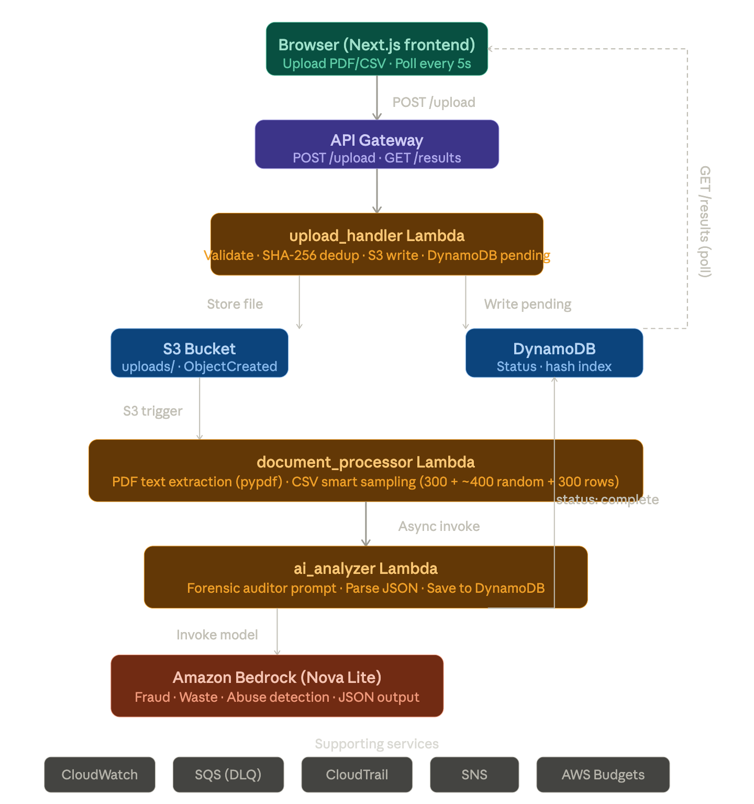
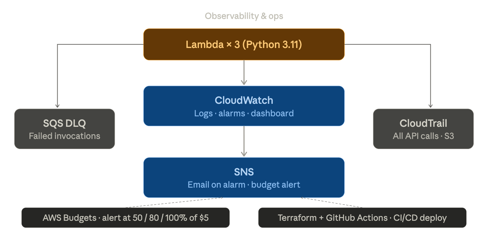

# Gov't Budget Auditor

A web app that lets anyone upload a government budget document and uses AI to automatically find fraud, waste, and abuse. Upload a file, the AI reads it like a skeptical government auditor, and you get a detailed report — analysis typically takes 1–3 minutes depending on file size.

**[Watch Demo Video](https://youtu.be/3ZYjXN-Bdjw)**

---

## The Problem it Solves

Government budget documents are public — but they're hundreds of pages long and nobody reads them. Auditors cost money and take weeks. This tool scans an entire budget document and surfaces exactly what a human auditor would flag.

---

## AWS Architecture



### Architecture Diagram

```
User (Browser)
│
│  Upload PDF/CSV
▼
Next.js Frontend (localhost)
│
│  POST /upload
▼
API Gateway (REST API)
│
├──► upload_handler Lambda
│         │
│         ├── Validates file (PDF/CSV, max 10MB)
│         ├── Computes SHA-256 hash (duplicate detection)
│         ├── Checks DynamoDB for existing hash
│         │     └── If duplicate → return cached document_id
│         ├── Stores file in S3 (uploads/)
│         └── Writes "pending" record to DynamoDB
│
│  S3 ObjectCreated event
▼
document_processor Lambda
│
├── PDF → extracts text page by page (pypdf)
├── CSV → smart samples rows if file is too large
│         (first 300 + ~400 random middle + last 300)
└── Invokes ai_analyzer Lambda (async)
│
▼
ai_analyzer Lambda
│
├── Sends text to Amazon Bedrock (Nova Lite)
│     └── Prompt: forensic gov't auditor
│           detects fraud, waste, abuse
├── Parses AI JSON response
└── Saves results to DynamoDB (status: complete)
│
│  GET /results?documentId=...  (polls every 5s)
▼
API Gateway → ai_analyzer Lambda → DynamoDB → returns results
│
▼
Frontend displays:
- Document Summary
- Fraud / Waste / Abuse counts
- Executive Summary
- Detected Anomalies (with severity)
```



---

## AWS Services and Why Each One

| Service | What it does in this project |
|---|---|
| **API Gateway** | The front door — exposes `POST /upload` and `GET /results` to the browser |
| **Lambda (×3)** | Serverless functions — no server to manage, pay only when running |
| **S3** | Stores uploaded files AND automatically triggers processing when a file arrives |
| **DynamoDB** | Stores analysis results, indexed by file hash for instant duplicate detection |
| **Amazon Bedrock** | The AI — Nova Lite model reads the document and returns fraud findings |
| **CloudWatch** | Logs everything, fires alarms if any Lambda has errors |
| **X-Ray** | Traces Lambda execution, shows timing of calls to S3, DynamoDB, and Bedrock |
| **SNS** | Sends email alerts when alarms trigger or budget is exceeded |
| **CloudTrail** | Audit log of every AWS action — who did what and when |
| **SQS Dead Letter Queue** | Catches failed Lambda invocations so nothing is silently lost |
| **AWS Budgets** | Alerts at 50%, 80%, 100% of the $5/month cap |
| **Terraform** | All infrastructure defined as code — one command deploys everything |
| **GitHub Actions** | Push to main → automatically deploys to AWS |

---

## The Three Lambda Functions

**upload_handler** — The gatekeeper
- Validates the file is PDF or CSV, under 10MB
- Computes a SHA-256 fingerprint of the file
- Checks if this exact file was analyzed before — if yes, returns cached results (saves AI cost)
- Saves the file to S3 and writes a "pending" record to DynamoDB

**document_processor** — The reader
- Triggered automatically when a file lands in S3
- PDF: uses pypdf to extract text from every page, skips image-only pages
- CSV: if small, sends everything; if large, takes a smart sample (first 300 rows + ~400 random middle rows + last 300 rows)
- Passes the text to the AI analyzer

**ai_analyzer** — The auditor
- Sends the text to Amazon Bedrock with a detailed forensic auditor prompt
- The prompt defines fraud, waste, and abuse using real GAO and Inspector General standards
- Returns a document summary, fraud/waste/abuse counts, and every suspicious item with severity
- Saves everything to DynamoDB

---

## The AI Prompt

The AI is told it is a "highly skeptical forensic government auditor with 20 years of experience." It is given:
- Exact definitions of fraud, waste, and abuse based on federal standards
- 15 specific red flags to always check (round numbers, threshold gaming, vague descriptions, etc.)
- Instructions to flag everything — it is better to over-flag than miss real fraud
- A mandate that "no anomalies" is only acceptable if the document has fewer than 3 transactions

---

## Limitations

- **10 MB max** file size (API Gateway hard limit)
- **Large PDFs**: text is capped at 180,000 characters — for dense documents this may cover only the first portion. User is warned when this happens.
- **Large CSVs**: smart sampling — first 300 rows, ~400 random middle rows, last 300 rows. Rows outside the sample are not analyzed.
- **Scanned PDFs**: if the PDF is a photo of a document, text cannot be extracted
- **No login**: anyone with the URL can upload — demo use only
- **AI can be wrong**: it may flag legitimate spending (false positives) or miss fraud that requires external data to verify
- **Analysis time**: 1–3 minutes for most files, up to 5 minutes for very large ones

---

## Run Locally

**Prerequisites:** AWS CLI configured, Node.js 20

The backend deploys automatically to AWS via GitHub Actions on every push to `main`. To run the frontend locally:

```bash
cd frontend
npm install
npm run dev
```

Open http://localhost:3000

The frontend talks to the live AWS backend via API Gateway.

---

## FinOps & Cost Optimization

This project was designed with cost efficiency in mind:

**Infrastructure is not permanently hosted** — AWS resources were deployed for development and demonstration, then torn down to avoid ongoing charges. Terraform makes it trivial to `terraform destroy` and redeploy when needed.

**Cost controls built-in:**
- **AWS Budgets** — alerts at 50%, 80%, and 100% of $5/month spend limit
- **CloudWatch Alarms** — monitors Lambda errors and triggers SNS email alerts
- **Duplicate detection** — SHA-256 hash check prevents re-analyzing the same file (saves Bedrock AI costs)
- **Smart sampling for large CSVs** — only processes ~1,000 rows instead of entire file
- **Text truncation for large PDFs** — caps at 180,000 characters to control Bedrock token usage
- **Serverless architecture** — pay only when code runs, no idle server costs
- **Free tier usage** — Lambda, API Gateway, S3, DynamoDB, CloudWatch all within free tier at low usage

**Actual cost at low usage:** ~$0.01–$0.05/month (primarily Bedrock token charges)

**Why not hosted permanently:** At demo/portfolio scale, the ongoing cost (even if minimal) isn't justified. The infrastructure can be redeployed in minutes when needed for live demos.
